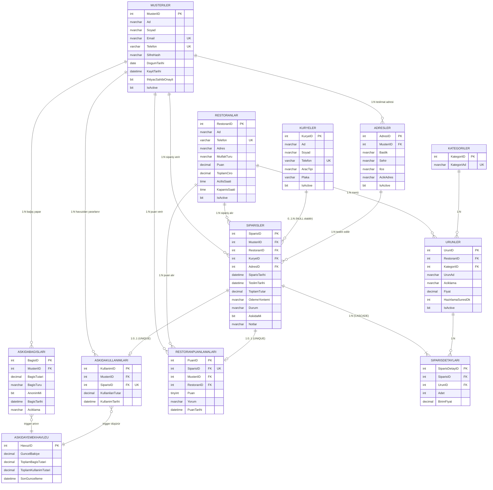

# Varlık-İlişki (ER) Diyagramı

Aşağıdaki Mermaid diyagramı **YemekSiparisDB** veritabanının tüm tablolarını ve aralarındaki ilişkileri (PK/FK, kardinalite) gösterir. GitHub bu dosyayı otomatik olarak render eder.

## Mermaid Kaynağı

## Kardinalite Açıklamaları

| İlişki                                            | Tip       | Notlar                                                     |
|---------------------------------------------------|-----------|------------------------------------------------------------|
| Musteriler → Adresler                             | 1 : N     | Müşterinin birden fazla adresi olabilir                    |
| Musteriler → Siparisler                           | 1 : N     | Müşteri sipariş verebilir                                  |
| Musteriler → AskidaBagislari                      | 1 : N     | Bir müşteri birden çok bağış yapabilir                     |
| Musteriler → AskidaKullanimlari                   | 1 : N     | Onaylı müşteri birden çok kez yararlanabilir               |
| Restoranlar → Urunler                             | 1 : N     | Bir restoranın bir menüsü vardır                           |
| Restoranlar → Siparisler                          | 1 : N     | Bir restoran çok sipariş alır                              |
| Kategoriler → Urunler                             | 1 : N     | 3NF gereği kategori ayrı tabloda                           |
| Kuryeler → Siparisler                             | 0..1 : N  | KuryeID NULL olabilir (henüz atanmamış)                    |
| Siparisler ↔ Urunler                              | M : N     | `SiparisDetaylari` ile çözümlenmiştir                      |
| Siparisler → SiparisDetaylari                     | 1 : N     | `ON DELETE CASCADE`                                        |
| Siparisler → RestoranPuanlamalari                 | 1 : 0..1  | `UNIQUE(SiparisID)`                                        |
| Siparisler → AskidaKullanimlari                   | 1 : 0..1  | `UNIQUE(SiparisID)`                                        |
| AskidaBagislari → AskidaYemekHavuzu               | trigger   | INSERT sonrası havuz artar                                 |
| AskidaKullanimlari → AskidaYemekHavuzu            | trigger   | INSERT sonrası havuz düşer (bakiye kontrolü)               |
